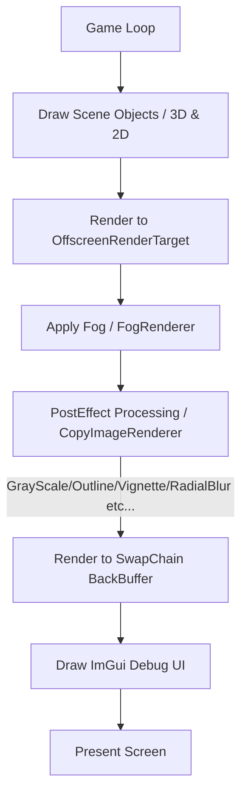

# 🌸 KohakuEngine - C++ & DirectX 12 3D Game Engine

[](https://github.com/FujiiKohaku/GE3/actions/workflows/Debug.yml)
[](https://github.com/FujiiKohaku/GE3/actions/workflows/DevelopBuild.yml)
[](https://github.com/FujiiKohaku/GE3/actions/workflows/ReleaseBuild.yml)

**KohakuEngine (コハクエンジン)** は、DirectX 12をネイティブにサポートしたC++ベースの本格派3Dゲームエンジンです。個人ゲーム開発および少人数チームを想定し、高度なレンダリングパイプライン、アニメーションアクター、エフェクトシステム、レベルエディタ連携など、すぐに3Dゲーム開発を始められる環境をワンパッケージで提供します。

---

## 🛠 動作環境・システム要件

| 項目 | 要件 |
| :--- | :--- |
| **開発OS** | Windows 10 / 11 (64bit) |
| **開発環境** | Visual Studio 2022 以降 (C++20規格対応推奨) |
| **グラフィックスAPI** | DirectX 12 (Feature Level 12_0以上) |
| **サウンドAPI** | XAudio2, Media Foundation |
| **入力システム** | DirectInput 8 |

### 📦 外部依存ライブラリ (Bundled in `project/externals`)
* **DirectXTex** - テクスチャローダーおよびDDS等のイメージハンドリング
* **Assimp** - FBX, OBJ, GLTFなどの多形式3Dモデルアセットインポート
* **nlohmann/json** - レベルデータ等のJSONファイルのシリアライズ/デシリアライズ
* **ImGui (docking branch)** - デバッグUI・パラメータ編集ツール

---

## 📂 詳細ディレクトリ構造とファイル配置

```text
c:\Projects\KohakuEngine\project\
├── App/                            # アプリケーション（ゲーム本体）レイヤー
│   ├── Game/                       # ゲームのオブジェクト定義（プレイヤー、エネミー等）
│   │   ├── Player/                 # プレイヤーキャラクター挙動
│   │   └── Enemy/                  # エネミー挙動と派生クラス定義
│   ├── Scene/                      # 各ゲームシーンの実装
│   │   ├── BaseScene.h/cpp         # 全シーンの抽象親クラス
│   │   ├── TitleScene.h/cpp        # タイトル画面シーン
│   │   ├── GamePlayScene.h/cpp     # メインゲームプレイシーン（レール移動・戦闘）
│   │   ├── ClearScene.h/cpp        # ゲームクリアシーン
│   │   ├── GameOverScene.h/cpp     # ゲームオーバーシーン
│   │   └── SceneManager.h/cpp      # シーンスタック・遷移およびポストエフェクト連携
│   └── main.cpp                    # エントリーポイント (WinMain)
│
├── Engine/                         # エンジン（システム）レイヤー
│   ├── 2D/                         # スプライト描画 (Sprite, SpriteManager)
│   ├── 3D/                         # 3Dモデル・静的/動的オブジェクト・スカイボックス
│   ├── Animation/                  # スキンニング・骨格キーフレーム補間・アクターシステム
│   ├── Audio/                      # XAudio2によるサウンド再生 (SoundManager)
│   ├── Camera/                     # 投影・視野角・ワールド座標スクリーン変換
│   ├── CollisionManager/           # レイキャスト衝突判定
│   ├── D3DResourceLeakChecker/     # DirectX12リソースリーク検知
│   ├── Debug/                      # プロファイラ、デバッグ描画 (Profiler, DebugRenderer)
│   ├── DirectXCommon/              # デバイス、コマンドリスト、スワップチェーン、フェンス
│   ├── EditorManager/              # レベルエディタパラメータ調整
│   ├── Effect/                     # Compute Shaderによるパーティクルシステム
│   ├── Fog/                        # フォグ定数バッファおよびパラメータ制御
│   ├── ImGuiManager/               # デバッグUI連携
│   ├── Input/                      # キーボード・マウス入力 (DirectInput 8)
│   ├── LevelEditor/                # JSON配置データパース (LevelDataLoader)
│   ├── Light/                      # 各種ライト (平行光源、点光源、スポットライト、環境光)
│   ├── Math/                       # ベクトル・行列・クォータニオン数学関数
│   ├── Particle/                   # パーティクル共通バッファ・描画管理
│   ├── PostEffect/                 # オフスクリーンレンダリングと各種ポストエフェクトパス
│   ├── Renderer/                   # レンダリングフローの統合管理
│   └── Winapp/                     # Win32ウィンドウ生成・メッセージループ
│
└── resources/                      # アセットリソースフォルダ
    ├── Models/                     # 3Dモデルデータ (.obj, .gltf)
    ├── Shaders/                    # HLSLシェーダーコード
    ├── Sounds/                     # 効果音・BGM (.wav)
    └── Textures/                   # テクスチャ画像 (.png, .dds)
```

---

## 🏗 コアアーキテクチャ (レンダリングフロー)

KohakuEngineは、マルチパスによるポストエフェクト描画を自動化する **オフスクリーンレンダリング** パイプラインを採用しています。



> [!NOTE]
> 描画時に `SceneManager` に描画コマンドを仲介させることで、シーン側は「バックバッファへの直接描画」を考慮せず、単純に `Draw3D()` や `Draw2D()` を実装するだけで自動的にポストエフェクトが適用されます。

---

## 🚀 ゲームループの構築手順

### 1. エントリーポイント (`main.cpp`)
すべてのライフサイクル（ウィンドウプロセッセージ、更新、描画、終了処理）を統括します。

```cpp
#include "Engine/ImGuiManager/ImGuiManager.h"
#include "Engine/Logger/Logger.h"
#include "Scene/Game.h"

int WINAPI WinMain(HINSTANCE, HINSTANCE, LPSTR, int)
{
    Logger::Initialize();
    Logger::Log("Application Start");

    // メモリリークチェッカーのインスタンス生成
    D3DResourceLeakChecker leakChecker;
    Game game;

    Logger::Log("Game Initialize");
    game.Initialize();

    MSG msg {};
    while (msg.message != WM_QUIT) {
        // メッセージループ処理
        if (WinApp::GetInstance()->ProcessMessage()) {
            Logger::Log("Window Close");
            break;
        }

        // ゲーム終了リクエストの監視
        if (game.IsEndRequest()) {
            Logger::Log("Game End Request");
            break;
        }

        // 更新と描画
        game.Update();
        game.Draw();
    }

    Logger::Log("Game Finalize");
    game.Finalize();

    Logger::Log("Application End");
    Logger::Finalize();

    return 0;
}
```

### 2. メイン管理クラス (`Game.cpp` / `Game.h`)
初期化順序はDirectX 12リソースのライフサイクルに直結しているため、以下の順序を厳守して構築されています。

```cpp
#include "Game.h"
#include "Engine/Debug/Profiler/Profiler.h"

void Game::Initialize()
{
    ShowCursor(FALSE); // マウスクリップ時のカーソル非表示化
    SetUnhandledExceptionFilter(Utility::ExportDump); // クラッシュ時のダンプエクスポート設定

    // 1. プロファイラの初期化
    Profiler::GetInstance()->Initialize();
    Profiler::GetInstance()->GetBootProfiler()->Begin("Engine Initialize");

    // 2. ウィンドウおよびDirectXコア初期化
    WinApp::GetInstance()->initialize();
    DirectXCommon::GetInstance()->Initialize(WinApp::GetInstance());
    SrvManager::GetInstance()->Initialize(DirectXCommon::GetInstance());

    // 3. 各種アセット・システムマネージャーの初期化
    TextureManager::GetInstance()->Initialize(DirectXCommon::GetInstance(), SrvManager::GetInstance());
    ImGuiManager::GetInstance()->Initialize(WinApp::GetInstance(), DirectXCommon::GetInstance(), SrvManager::GetInstance());
    SpriteManager::GetInstance()->Initialize(DirectXCommon::GetInstance());
    ModelManager::GetInstance()->Initialize(DirectXCommon::GetInstance());
    Object3dManager::GetInstance()->Initialize(DirectXCommon::GetInstance());
    SkinningObject3dManager::GetInstance()->Initialize(DirectXCommon::GetInstance());
    SkyBoxManager::GetInstance()->Initialize(DirectXCommon::GetInstance());
    LightManager::GetInstance()->Initialize(DirectXCommon::GetInstance());
    DebugRenderer::GetInstance()->Initialize();
    Input::GetInstance()->Initialize(WinApp::GetInstance());
    SoundManager::GetInstance()->Initialize();

    // 4. レンダラーの生成と初期シーン(TitleScene)のロード
    renderer_ = std::make_unique<Renderer>();
    renderer_->Initialize();
    SceneManager::GetInstance()->SetNextScene(std::make_unique<TitleScene>());

    Profiler::GetInstance()->GetBootProfiler()->End("Engine Initialize");
    Profiler::GetInstance()->GetBootProfiler()->FinalizeBootMeasure(); // 起動時間プロファイルの確定
}

void Game::Update()
{
    Profiler::GetInstance()->BeginFrame();
    Profiler::GetInstance()->Update();

    Input::GetInstance()->Update();

    // デバッグ用キーコントロール
    if (Input::GetInstance()->IsKeyTrigger(DIK_F2)) {
        isMouseCursorVisible_ = !isMouseCursorVisible_;
        if (isMouseCursorVisible_) {
            ShowCursor(TRUE);
            ClipCursor(nullptr); // クリップ解除
        } else {
            ShowCursor(FALSE);
            LockCursorToWindow(); // クリップオン
        }
    }

    ImGuiManager::GetInstance()->Begin();

    // シーン更新
    SceneManager::GetInstance()->Update();
    DebugRenderer::GetInstance()->Update();

    // レンダラー情報更新
    renderer_->Update();

    ImGuiManager::GetInstance()->End();
    Profiler::GetInstance()->EndFrame();
}

void Game::Draw()
{
    // レンダラー経由で描画を実行
    renderer_->Draw(SceneManager::GetInstance());
}

void Game::Finalize()
{
    ClipCursor(nullptr);
    ShowCursor(TRUE);

    SceneManager::GetInstance()->Finalize();
    ImGuiManager::GetInstance()->Finalize();
    renderer_.reset();

    // 各種シングルトンインスタンスのクリーンアップ
    SkinningObject3dManager::GetInstance()->Finalize();
    DebugRenderer::GetInstance()->Finalize();
    Object3dManager::GetInstance()->Finalize();
    SpriteManager::GetInstance()->Finalize();
    ModelManager::GetInstance()->Finalize();
    SkyBoxManager::GetInstance()->Finalize();
    LightManager::GetInstance()->Finalize();
    TextureManager::GetInstance()->Finalize();
    SrvManager::GetInstance()->Finalize();
    SoundManager::GetInstance()->Finalize();
    DirectXCommon::GetInstance()->Finalize();
    WinApp::FinalizeInstance();
    Profiler::FinalizeInstance();
}
```

---

## 🎨 グラフィックスパイプライン & HLSLシェーダー構成

頂点レイアウト情報とインプット要素は、HLSL側のセマンティクスと正確に一致している必要があります。

### 1. 静的3Dオブジェクト (`Object3d` / `Glow`)
* **頂点シェーダー**: `resources/Shaders/Object3D/Object3d.VS.hlsl`
* **ピクセルシェーダー**: `resources/Shaders/Object3D/Object3d.PS.hlsl` / `Glow.PS.hlsl`

| セマンティクス名 (SemanticName) | インデックス | フォーマット (Format) | バイトオフセット | 説明 |
| :--- | :--- | :--- | :--- | :--- |
| `POSITION` | 0 | `DXGI_FORMAT_R32G32B32A32_FLOAT` | 0 | 頂点座標 (x, y, z, w) |
| `TEXCOORD` | 0 | `DXGI_FORMAT_R32G32_FLOAT` | D3D12_APPEND_ALIGNED | UV座標 (u, v) |
| `NORMAL` | 0 | `DXGI_FORMAT_R32G32B32_FLOAT` | D3D12_APPEND_ALIGNED | 法線ベクトル (nx, ny, nz) |

### 2. スキンニング3Dオブジェクト (`SkinningObject3d`)
* **頂点シェーダー**: `resources/Shaders/Object3D/Object3d.VS.hlsl`
* **ピクセルシェーダー**: `resources/Shaders/Object3D/SkinningObject3d.PS.hlsl`
* **インプットスロットの分割 (マルチストリーム)**: スキンウェイト情報は頻繁に更新、または静的頂点と別に管理されるため、Slot 1に割り当てられます。

| セマンティクス名 | インデックス | フォーマット | スロット (InputSlot) | 説明 |
| :--- | :--- | :--- | :--- | :--- |
| `POSITION` | 0 | `DXGI_FORMAT_R32G32B32A32_FLOAT` | 0 | 頂点座標 (Slot 0) |
| `TEXCOORD` | 0 | `DXGI_FORMAT_R32G32_FLOAT` | 0 | UV座標 (Slot 0) |
| `NORMAL` | 0 | `DXGI_FORMAT_R32G32B32_FLOAT` | 0 | 法線ベクトル (Slot 0) |
| `WEIGHT` | 0 | `DXGI_FORMAT_R32G32B32A32_FLOAT` | 1 | スキンウェイト (Slot 1) |
| `INDEX` | 0 | `DXGI_FORMAT_R32G32B32A32_SINT` | 1 | 影響を受けるボーンIndex (Slot 1) |

---

## 🛠 APIリファレンス & 詳細なコード使用例

### 📊 1. 3D描画システム (`Object3d` / `ModelManager`)
モデルローダーとアタッチオブジェクト。

#### 主要API仕様
* `Model* ModelManager::Load(const std::string& filepath)`: モデルデータをロードしてポインタを返します。
* `void Object3d::Initialize(Object3dManager* manager)`: 3Dオブジェクトを初期化します。
* `void Object3d::SetModel(Model* model)`: 描画するモデルを設定します。
* `void Object3d::SetColor(const Vector4& color)`: マテリアル色を設定します。
* `void Object3d::SetEnableLighting(bool enable)`: ライティング計算の有効/無効を設定します。

#### 使用例
```cpp
// 1. モデルアセットの登録
Model* baseModel = ModelManager::GetInstance()->Load("Models/Sphere/sphere.obj");

// 2. インスタンス生成と初期化
std::unique_ptr<Object3d> sphereObj = std::make_unique<Object3d>();
sphereObj->Initialize(Object3dManager::GetInstance());
sphereObj->SetModel(baseModel);
sphereObj->SetCamera(camera_.get()); // カメラのバインド

// 3. マテリアルパラメータの設定
sphereObj->SetColor({ 1.0f, 0.8f, 0.8f, 1.0f });
sphereObj->SetEnableLighting(true); // 平行光源の影響を有効化

// 4. トランスフォームの適用
sphereObj->SetTranslate({ 0.0f, 2.0f, -5.0f });
sphereObj->SetRotate({ 0.0f, 1.57f, 0.0f }); // Y軸 90度回転
sphereObj->SetScale({ 2.0f, 2.0f, 2.0f });

// 5. 更新と描画
sphereObj->Update();
sphereObj->Draw();
```

---

### 🏃 2. アニメーション付きオブジェクト管理 (`AnimationActor`)
ボーン変形モデルの生成からポーズ更新までをカプセル化したアクター。

#### 主要API仕様
* `void AnimationActor::Initialize(const std::string& modelName)`: gltfモデル・スケルトン・アニメーションを一元ロードします。
* `void AnimationActor::Update(float deltaTime)`: 経過時間に応じてキーフレームを線形または球面補間してボーンを姿勢制御します。
* `void AnimationActor::Draw()`: スキンニング描画を行います。

#### 使用例
```cpp
// 1. アクターのセットアップ
std::unique_ptr<AnimationActor> character = std::make_unique<AnimationActor>();
character->Initialize("Characters/Animation/Walk/walk.gltf");
character->SetScale({ 1.0f, 1.0f, 1.0f });

// 2. 更新 (毎フレーム)
float deltaTime = 1.0f / 60.0f; // 前フレームの経過時間
character->SetTranslate(characterPos);
character->Update(deltaTime);

// 3. 描画 (Draw3Dパス内)
character->Draw();
```

---

### 🖼 3. 2Dスプライト描画 (`Sprite`)
スクリーン空間への2Dテクスチャ描画。

#### 主要API仕様
* `void Sprite::Initialize(SpriteManager* manager, std::string texturePath)`: スプライトを初期化します。
* `void Sprite::SetAnchorPoint(const Vector2& anchor)`: 基準位置（左上 0,0 〜 右下 1,1）を指定。
* `void Sprite::SetTextureLeftTop(const Vector2& leftTop)`: 切り出しの開始ピクセル座標。
* `void Sprite::SetTextureSize(const Vector2& size)`: 切り出すピクセルサイズ。

#### 使用例
```cpp
// 1. スプライトの作成
std::unique_ptr<Sprite> crosshair = std::make_unique<Sprite>();
crosshair->Initialize(SpriteManager::GetInstance(), "Textures/crosshair.png");

// 2. 中心を原点として設定 (アンカーポイント 0.5, 0.5)
crosshair->SetAnchorPoint({ 0.5f, 0.5f });
crosshair->SetPosition({ 640.0f, 360.0f }); // 画面中央 (1280x720解像度の場合)
crosshair->SetSize({ 32.0f, 32.0f });
crosshair->SetColor({ 0.0f, 1.0f, 0.0f, 0.8f }); // 緑色・半透明

// 3. テクスチャの部分切り出し (UV切り出し)
// テクスチャ画像が複数アイコンのシートの場合
crosshair->SetTextureLeftTop({ 64.0f, 0.0f });
crosshair->SetTextureSize({ 32.0f, 32.0f });

// 4. 更新と描画
crosshair->Update();
crosshair->Draw();
```

---

### 🔊 4. 音声管理 (`SoundManager`)
XAudio2による複数音声バッファ制御。

#### 主要API仕様
* `SoundData SoundManager::SoundLoadFile(const std::string& filename)`: WAVファイルをメモリにパースしてSoundData構造体に展開します。
* `void SoundManager::SoundPlayWave(const SoundData& soundData)`: 効果音を再生します。
* `void SoundManager::SoundUnload(SoundData* soundData)`: サウンドバッファをメモリ解放します。

#### 使用例
```cpp
// 1. 効果音・BGMアセットのロード
SoundData soundSE = SoundManager::GetInstance()->SoundLoadFile("Sounds/Explosion.wav");

// 2. 再生 (ノンブロッキングで非同期再生)
SoundManager::GetInstance()->SoundPlayWave(soundSE);

// 3. 解放処理 (シーン終了時等)
SoundManager::GetInstance()->SoundUnload(&soundSE);
```

---

### 💥 5. エフェクト・パーティクル制御 (`EffectManager`)
JSON構成ファイルベースのCompute Shader制御エフェクト。

#### 使用例
```cpp
// 1. 毎フレーム追従するエフェクト
// プレイヤーの推進ノズルから出るエフェクトをアタッチ
EffectHandle thrusterEffect = EffectManager::GetInstance()->AttachEffect(
    "ThrusterFlame", 
    playerObj.get(), 
    -1.0f // 無限ループ再生
);

// 2. 位置を更新する
Vector3 currentEmitterPos = playerObj->GetTranslate();
EffectManager::GetInstance()->SetEffectPosition(thrusterEffect, currentEmitterPos);

// 3. 不要になったタイミングで停止
if (isPlayerDied) {
    EffectManager::GetInstance()->StopEffect(thrusterEffect);
}
```

---

### 🎯 6. 衝突判定システムとレイキャスト (`CollisionManager` / `Collision`)
数理ジオメトリを用いた物理判定。

```cpp
#include "Engine/CollisionManager/CollisionManager.h"
#include "Engine/Math/Ray.h"
#include "Engine/Math/Collision.h"

void GamePlayScene::CheckCollision()
{
    // レイの作成 (カメラ正面方向にレイを投射)
    Ray cameraRay;
    cameraRay.origin = camera_->GetTranslate();
    
    // カメラの向きベクトルを取得
    Matrix4x4 rotMat = MatrixMath::MakeRotateXYZ(camera_->GetRotate());
    cameraRay.direction = MatrixMath::Transform({0.0f, 0.0f, 1.0f}, rotMat);

    RaycastHit hitInfo;
    
    // 1. シーン内のエネミーとの判定
    CollisionManager::GetInstance()->SetEnemies(&enemies_);
    if (CollisionManager::GetInstance()->Raycast(cameraRay, hitInfo)) {
        // レイキャストが衝突したエネミーの取得
        BaseEnemy* targetEnemy = hitInfo.enemy;
        float distanceToTarget = hitInfo.distance;
        
        // ターゲットへロックオンインジケータを描画するなど
        lockonUI->SetPosition(camera_->WorldToScreen(hitInfo.position));
    }

    // 2. 個別の数学的レイ・球交差判定の使用例
    Sphere boundingSphere;
    boundingSphere.center = spherePos;
    boundingSphere.radius = 2.5f;

    float intersectDistance = 0.0f;
    if (RaySphereIntersect(cameraRay, boundingSphere, intersectDistance)) {
        // 交差した場合の処理
        OutputDebugStringA("Sphere Intersected!\n");
    }
}
```

---

## 🗺 レベルエディタ連携 (Blender座標系変換仕様)

`LevelDataLoader` は、Blenderなどの3DツールからエクスポートしたJSON配置データをパースします。

> [!CAUTION]
> **Blender座標系との互換変換仕様**
> Blenderは**右手系・Z-Up**を採用していますが、KohakuEngineは**左手系・Y-Up**を採用しています。
> JSONロード時に、以下のルールに基づき自動的に座標・回転・スケールの軸変換処理が行われます。

$$
\begin{aligned}
\text{Translation: } \quad &X_{engine} = X_{json}, \quad Y_{engine} = Z_{json}, \quad Z_{engine} = Y_{json} \\
\text{Rotation: } \quad &\theta X_{engine} = -\theta X_{json}, \quad \theta Y_{engine} = -\theta Z_{json}, \quad \theta Z_{engine} = -\theta Y_{json} \\
\text{Scale: } \quad &S_x = S_{x, json}, \quad S_y = S_{z, json}, \quad S_z = S_{y, json}
\end{aligned}
$$

### JSON構造サンプル
```json
{
  "scene": [
    {
      "name": "BaseTerrain",
      "type": "MESH",
      "file_name": "Environment/Terrain/terrain.obj",
      "transform": {
        "translation": [0.0, 0.0, -10.0],
        "rotation": [0.0, 0.0, 0.0],
        "scale": [1.0, 1.0, 1.0]
      },
      "children": []
    }
  ]
}
```

---

## ⏱ プロファイラの活用

KohakuEngineには、ボトルネック検出のために **処理区間別の時間計測マクロ** が提供されています。

```cpp
#include "Engine/Debug/Profiler/ProfilerScope.h"

void CustomUpdate()
{
    // スコープ内の処理時間を記録し、ImGuiプロファイラパネルに "PlayerCalculate" というラベルで結果を表示
    ProfilerScope scope("PlayerCalculate");

    CalculatePhysics();
    ProcessMove();
} // スコープを抜けた際に自動で計測完了
```
ImGui表示パネルで、各セクションの平均所要時間 (ms)、フレームレート (fps) をリアルタイムでグラフ可視化できます。
